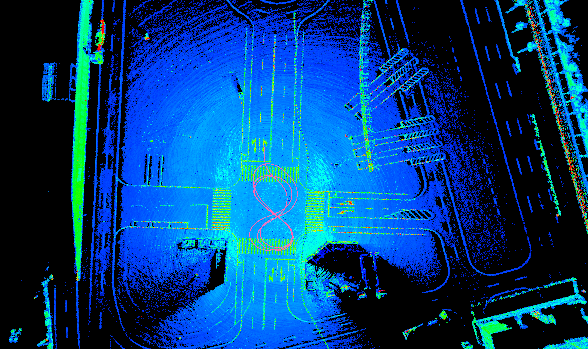

## Introduction

This is a project for LiDAR to pose-sensor calibration <a href="https://arxiv.org/" title="paper">[paper]</a>. 
<strong>Note: </strong> Some code based on octree fine-tuning and z-axis correction has been removed temporarily due to some ownership and data protection policies. The removed part of the code is easy to implement; you can refer to the paper to implement it yourself. For more calibration codes, please refer to the link <a href="https://github.com/PJLab-ADG/SensorsCalibration" title="SensorsCalibration">SensorsCalibration</a>

## Prerequisites

- Cmake
- opencv 2.4
- eigen 3
- PCL 1.9
- Pangolin

## Compile

```shell
# mkdir build
mkdir -p build && cd build
# build
cmake .. && make
```
## Automatic calibration tool

This automatic and user-friendly calibration tool is for calibrating the extrinsic parameter of LiDAR and pose-sensor in road scenes.
## Calibration data collection

According to the figure below for data collection, the calibration vehicle records IMU and LiDAR data.

1. Ensure that the ground is sufficiently flat
2. Ensure that there are enough features around, such as walls, lane lines, poles, stationary vehicles, etc.
3. The calibrated vehicle circulates three times according to the trajectory shown in the figure below, and the vehicle speed is maintained at 10km/h.
4. Try not to have dynamic objects around, such as vehicles, etc.

<br>

## Usage

2. Run the test sample:

   The executable file is under the bin folder.

   ```
   cd ~./auto_calib/
   ./bin/run_lidar2imu data/top_center_lidar/ data/NovAtel-pose-lidar-time.txt data/gnss-to-top_center_lidar-extrinsic.json
   ```
   **Note:** Because the data is relatively large, only part of the data is uploaded, the complete data can be downloaded from the link below.
   ```
   Link (链接): https://pan.baidu.com/s/1AODTuqhmgwbRWxGGCmo0iA 
   Extraction code (提取码): 94id
   ```

3. Calibration result:

    <br>
   
   comparison before and after calibration:<br>
   before calibration
   <br>
   after calibration<br>
   <br>

   point cloud feature map:<br>
   <br><br>
   <br><br>
   <br><br>

